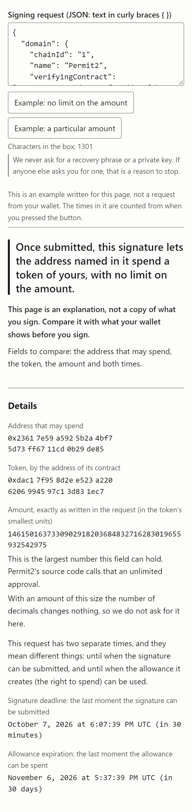

# Before you sign

A page that puts a wallet's signing request into plain words.

Paste the request your wallet shows before you press "Sign". For the request types listed under "What it reads", the page says what is written in it: who is given a right, over which token, how much, until when. For other requests it shows the fields as written. It does not say whether to sign.

**Open it:** https://vimakushin.github.io/before-you-sign/ ([по-русски](https://vimakushin.github.io/before-you-sign/#ru))

[Русская версия этого файла](README.ru.md)



The screenshot is cut off after the details. Below them the page goes on with how the request works, the list of what it has not checked, and the request as written. The request in it is an example put together by the project, not one taken from a wallet.

## Why signing requests

A common way to protect a wallet's user is to simulate a transaction and show what it would do. A signing request (EIP-712 typed data, the data behind `eth_signTypedData_v4`) is not a transaction. Signing it executes nothing. For the requests this page reads, it gives someone the right to do something later. There is no transaction to simulate.

What is left is to read what the request says. A wallet shows it as a data structure, with addresses in hexadecimal and amounts in the token's smallest units. A developer can read that. For most people who sign it, it is unreadable.

## It translates. It does not judge

The page never says a request is safe or unsafe, and never calls anyone a fraud. A wrong green screen would lead a person to sign something they otherwise would not.

That rule is built into the code rather than left to the wording:

- No colour on the page carries meaning.
- The parser's results are named for what the parser did (`parsed`, `unread`), not for what the request is.
- A protocol is named only when the whole domain of the request matches the one its authors publish: which fields it declares and every value the authors publish (the name, the address and the version, where the domain has one). When it does not match, the page says the request has that form and that it could not establish which contract it is for. It does not say why.
- A test fails if any sentence in either language contains a word from a fixed list of words that read as a verdict.

## What it reads

| Type | Described by |
|---|---|
| `Permit` | ERC-2612 |
| `Permit`, the kind DAI uses | DAI's contract source |
| `PermitSingle`, `PermitBatch` | Permit2's contract source |
| `PermitTransferFrom` | Permit2's contract source |
| `OrderComponents` | Seaport 1.5 and 1.6 contract source and documentation |

A type is matched on its full declaration, the string the protocol's own contract hashes, not on its name: ERC-2612 and DAI both call their type `Permit`, and anyone can name a struct `Permit`.

For any other type the page shows the fields as the request declares them and says it has no explanation for them. It does not guess which number is an amount and which is a deadline.

Each statement about a protocol comes with a quotation from that protocol's own source, next to the code that relies on it and with a link to a fixed commit: see [`src/known-types.js`](src/known-types.js) and [`src/values.js`](src/values.js).

## What it does not know and does not check

Every answer on the page lists these for the request in question. Taken together:

- **Who is behind an address.** Nothing is looked up.
- **Whether the token is the one you expect.**
- **The code at the contract's address.** Where a field is explained, the explanation repeats what the protocol's published source says. What that particular contract does has not been read. For DAI, the source that was read is a copy that says it was altered from the production version.
- **How many decimals a token has.** That is a property of the token and is not in the request. The exact integer is always shown; a converted amount is either two examples marked as assumptions (18 and 6 decimals) or the result for the number you enter yourself.
- **The network.** A contract's address is compared with the published one; that it is the same contract on the network the request names is not checked. Only the networks EIP-155 itself names are given a name.
- **Whether a contract outside the list belongs to the protocol.** The list of published domains is not complete.
- **Whether a token follows ERC-2612.** A request of that form can be addressed to any contract.
- **Whether you have approved Permit2 to spend the token.** Permit2's source says its allowances require that.
- **The checksum in an address's letter case** (ERC-55).
- **What your wallet does** with a field the request's types do not declare, or with a large number written without quotes. The digits are shown as written.
- **The current time.** "In 3 days" is counted from your device's clock; a contract goes by the network's.
- **A private key pasted by mistake.** A row of ten or more plain words, which is what a recovery phrase looks like, is not read and the box is cleared. A private key is a string of hexadecimal digits and is not caught.

And about the project itself:

- One request in the tests is a complete request with values, put together by the author from Permit2's published types. For the other types the tests use the type descriptions their authors publish, with values made up for the test. None is a capture of a request a wallet showed.
- The page has been checked in a desktop browser at phone widths, not on a phone.

What you sign is decided on your wallet's screen. This page is an explanation to compare it with, not a replacement for it.

## Nothing leaves the browser

Everything is computed in the page. There is no server, no build step and no dependency; the files in this repository are the files the browser runs.

The page makes no network requests while it works, and a Content-Security-Policy in [`index.html`](index.html) tells the browser to refuse any: scripts and styles from the same site only, every other kind of connection blocked. Nothing is stored either: no cookies, no local storage. The language is kept in the address of the page.

Everything that comes from a pasted request is put on the page as text, not as markup.

## Gifts

The bottom of the page has a line with the author's address for voluntary gifts in USDT on BNB Smart Chain (BEP-20). Nothing needs to be sent. The same address is written here, so that the two can be compared. The history of this repository shows when the address in this file was last changed:

`0xF65e04f7b5761b6BDc42726A54eE467736D0ca74`

## Running it

```
npm test
```

The tests need Node 21 or newer and install nothing.

To open the page locally, serve the folder with any static file server: browsers do not load JavaScript modules from `file://`.

## License

[MIT](LICENSE)
