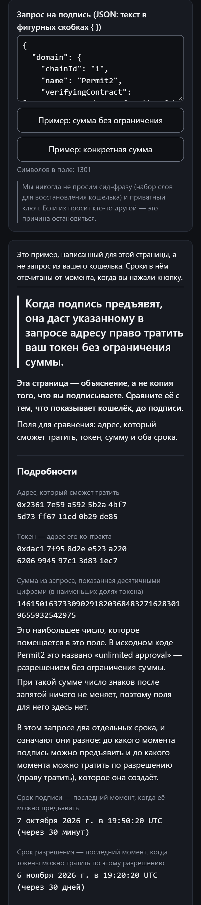

# Before you sign — перед тем как подписать

Страница, которая пересказывает простыми словами запрос на подпись из кошелька.

Вставьте запрос, который кошелёк показывает перед кнопкой «Подписать». Для типов запросов, перечисленных ниже в разделе «Что страница читает», страница скажет, что в нём написано: кому даётся право, на какой токен, на какую сумму, до какого срока. Для остальных запросов она покажет поля так, как они записаны. Подписывать ли запрос, она не говорит.

**Открыть:** https://vimakushin.github.io/before-you-sign/#ru

[English version of this file](README.md)



Снимок обрезан после подробностей. Ниже страница рассказывает, как устроен запрос, перечисляет, что не проверено, и показывает запрос так, как он записан. Запрос в нём — пример, составленный проектом, а не взятый из кошелька.

## Почему именно запросы на подпись

Распространённый способ защитить владельца кошелька — симулировать транзакцию и показать, что она сделает. Запрос на подпись (структурированные данные по EIP-712, данные, которые стоят за `eth_signTypedData_v4`) — не транзакция. Подпись под ним ничего не исполняет. В запросах, которые читает эта страница, она даёт кому-то право сделать что-то позже. Транзакции, которую можно было бы симулировать, здесь нет.

Остаётся прочитать, что в запросе написано. Кошелёк показывает его как структуру данных: адреса в шестнадцатеричной записи, суммы в наименьших долях токена. Разработчик это прочесть может. Для большинства тех, кто подписывает, это нечитаемо.

## Страница переводит, а не оценивает

Страница никогда не говорит, что запрос безопасен или опасен, и никого не называет мошенником. Неверный зелёный экран приведёт к тому, что человек подпишет то, что иначе бы не подписал.

Это правило встроено в код, а не оставлено на совести формулировок:

- Ни один цвет на странице не несёт смысла.
- Результаты разбора названы по тому, что сделал разбор (`parsed`, `unread`), а не по тому, каков запрос.
- Протокол называется по имени, только если весь домен запроса совпал с тем, который публикуют его авторы: какие поля он объявляет и каждое значение, которое публикуют авторы (имя, адрес и версию, если она есть в домене). Если не совпал, страница говорит, что запрос имеет такую форму и что установить, для какого он контракта, не удалось. Почему — она не говорит.
- Тест не проходит, если в любой фразе на любом из двух языков есть слово из заданного списка слов, которые читаются как оценка.

## Что страница читает

| Тип | Чем описан |
|---|---|
| `Permit` | ERC-2612 |
| `Permit` того вида, который использует DAI | исходный код контракта DAI |
| `PermitSingle`, `PermitBatch` | исходный код контракта Permit2 |
| `PermitTransferFrom` | исходный код контракта Permit2 |
| `OrderComponents` | исходный код и документация Seaport 1.5 и 1.6 |

Тип определяется по полному объявлению — по той строке, которую хеширует сам контракт протокола, — а не по имени: ERC-2612 и DAI называют свой тип одинаково, `Permit`, и назвать так структуру может кто угодно.

Для любого другого типа страница показывает поля так, как они объявлены в запросе, и говорит, что объяснения для них у неё нет. Какое из чисел сумма, а какое срок, она не гадает.

К каждому утверждению о протоколе приведена цитата из источника самого протокола — рядом с кодом, который на него опирается, со ссылкой на конкретный коммит: см. [`src/known-types.js`](src/known-types.js) и [`src/values.js`](src/values.js).

## Чего страница не знает и не проверяет

Каждый ответ на странице перечисляет это для своего запроса. Всё вместе:

- **Кто стоит за адресом.** Страница ничего и нигде не ищет.
- **Тот ли это токен, на который вы рассчитываете.**
- **Код, который находится по адресу контракта.** Там, где поле объяснено, объяснение повторяет опубликованный источник протокола. Что делает именно этот контракт, мы не читали. Для DAI прочитана копия исходного кода, в которой сказано, что она изменена по сравнению с рабочей версией.
- **Сколько у токена знаков после запятой.** Это свойство токена, в запросе его нет. Точное целое показывается всегда; пересчёт — либо два примера, помеченных как предположения (18 и 6 знаков), либо результат для числа, которое вы ввели сами.
- **Сеть.** Адрес контракта сравнивается с опубликованным; что в сети, названной в запросе, это тот же контракт, не проверяется. Названия даны только тем сетям, которые названы в самом EIP-155.
- **Относится ли к протоколу контракт, которого нет в перечне.** Перечень опубликованных доменов неполон.
- **Следует ли токен стандарту ERC-2612.** Запрос такой формы может быть адресован любому контракту.
- **Давали ли вы Permit2 одобрение тратить этот токен.** В источнике Permit2 сказано, что его разрешения этого требуют.
- **Контрольная сумма в регистре букв адреса** (ERC-55).
- **Что сделает ваш кошелёк** с полем, которого нет в типах запроса, или с большим числом, записанным без кавычек. Цифры показываются так, как записаны.
- **Текущее время.** «Через 3 дня» считается по часам вашего устройства; контракт считает по времени сети.
- **Приватный ключ, вставленный по ошибке.** Ряд из десяти и более обычных слов — так выглядит сид-фраза (набор слов для восстановления кошелька) — страница не разбирает, и поле очищается. Приватный ключ — это строка шестнадцатеричных цифр, и он так не ловится.

И о самом проекте:

- В тестах один запрос — полный, со значениями; его составил автор из опубликованных типов Permit2. Для остальных типов тесты берут описания типов, которые публикуют их авторы, а значения составлены для теста. Ни один запрос не снят с экрана кошелька.
- Страница проверена в настольном браузере при ширине телефона, а не на телефоне.

Что именно вы подписываете, решается на экране кошелька. Эта страница — объяснение, с которым его можно сравнить, а не замена ему.

## Ничего не покидает браузер

Всё считается на самой странице. Нет ни сервера, ни сборки, ни зависимостей: файлы в этом репозитории — те самые, которые исполняет браузер.

При работе страница не делает сетевых обращений, и правило Content-Security-Policy в [`index.html`](index.html) велит браузеру отклонять любые: скрипты и стили только с того же сайта, все остальные соединения запрещены. Ничего и не сохраняется: ни cookie, ни локального хранилища. Язык хранится в адресе страницы.

Всё, что приходит из вставленного запроса, попадает на страницу как текст, а не как разметка.

## Подарки

Внизу страницы есть строка с адресом автора для добровольных подарков в USDT в сети BNB Smart Chain (BEP-20). Присылать ничего не нужно. Тот же адрес записан здесь, чтобы вы могли сверить его с адресом на странице. По истории этого репозитория видно, когда адрес в этом файле менялся в последний раз:

`0xF65e04f7b5761b6BDc42726A54eE467736D0ca74`

## Запуск

```
npm test
```

Тестам нужен Node версии 21 или новее; они ничего не устанавливают.

Чтобы открыть страницу у себя, раздайте папку любым сервером статических файлов: браузеры не загружают модули JavaScript из `file://`.

## Лицензия

[MIT](LICENSE)
